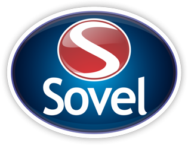

<!-- ====================== -->
<!-- README - GRUPO SOVEL -->
<!-- ====================== -->

<!-- Estilo global -->

<!-- ====================== -->
<!-- Bloco Logo + Título -->
<!-- ====================== -->

  <!-- Logo centralizada em container transparente com glow -->
  

    
  

  <!-- Título neon -->
  <h1 style="color:#00eaff; text-shadow:0 0 20px #00eaff; margin-top:20px;">
    ⚙️ Sistema de Gestão de Ferramentais ⚙️
  </h1>

  <!-- Subtítulo -->
  

    <b>Departamento de Amostras e Clicheria</b> 
    <b>Grupo Sovel da Amazônia</b>
  

  <!-- Badges -->
  

    
    
    
    
  

  <!-- Botão Painel Interativo neon animado -->
  

    <a href="docs/index.html" target="_blank" class="neon-button">
      Acessar Painel Interativo
    </a>
  

<!-- ====================== -->
<!-- Sobre o Projeto -->
<!-- ====================== -->
<h2 style="color:#00bfff; text-shadow:0 0 15px #00eaff;">💡 Sobre o Projeto</h2>

  O <b>Sistema de Gestão de Ferramentais</b> tem como propósito <b>automatizar e digitalizar</b> o controle de ferramentais do <b>Departamento de Amostras e Clicheria</b>.  
  Através de uma interface moderna e integração com <b>QR Codes</b>, o sistema gerencia <b>todo o ciclo de vida das ferramentas</b>, desde o recebimento até a substituição.

  🔹 Cada ferramenta possui um <b>QR Code exclusivo</b> contendo informações técnicas e rastreáveis. 
  🔹 Foco em <b>eficiência, agilidade e segurança operacional</b>. 
  🔹 Desenvolvido com base em <b>inovação tecnológica e melhoria contínua</b>.

<!-- ====================== -->
<!-- Grupo Sovel -->
<!-- ====================== -->
<h2 style="color:#00bfff;">🏢 Grupo Sovel da Amazônia</h2>

<b>Departamento de Amostras e Clicheria</b>

<!-- ====================== -->
<!-- Equipe D.A.C -->
<!-- ====================== -->
<h2 style="color:#00bfff; text-shadow:0 0 20px #00eaff; text-align:center; margin-bottom:30px;">👥 Equipe D.A.C</h2>

  

    <h3>⚡ Samueldson Ferreira</h3>
    
🛡️ Supervisor

  

  

    <h3>📊 Rafaelly Azevedo</h3>
    
💼 Analista Administrativo

  

  

    <h3>🔧 Elienson Duarte</h3>
    
🛠️ Assistente

  

  

    <h3>🔧 Gustavo Albuquerque</h3>
    
🛠️ Assistente

  

  

    <h3>🔧 Vanessa Nascimento</h3>
    
🛠️ Assistente

  

<!-- Tecnologias -->
<h2 style="color:#00bfff;">🛠️ Tecnologias e Recursos</h2>

<pre style="background-color:#0d1b2a; color:#00eaff; padding:20px; border-radius:10px; box-shadow:0 0 20px #00eaff22; text-align:left;">
- Interface responsiva (HTML5/CSS3)
- Controle de ferramentais via QR Code
- Painel interativo e intuitivo
- Relatórios e histórico de movimentações
- Base pronta para integração com banco de dados interno
</pre>

<!-- Contato -->
<h2 style="color:#00bfff;">💬 Contato e Sugestões</h2>

  Envie suas ideias e melhorias diretamente para o <b>Departamento de Amostras e Clicheria</b>.  
  📧 <a href="mailto:dac@sovel.com.br">dac@sovel.com.br</a> 
  📍 Manaus - AM, Brasil

  “Eficiência e inovação caminham lado a lado quando trabalhamos com propósito.”

<b>— Equipe D.A.C | Grupo Sovel da Amazônia</b>

© 2025 Grupo Sovel da Amazônia • Departamento de Amostras e Clicheria
